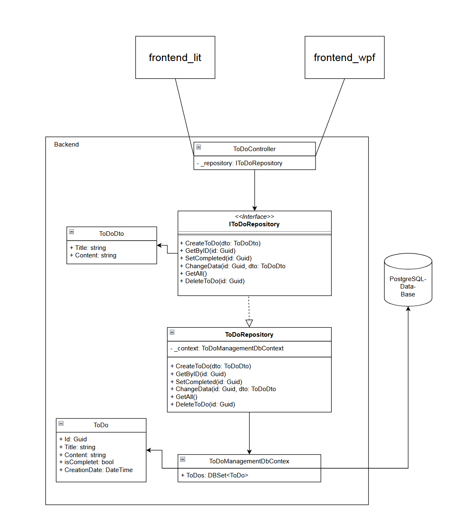

---
title:
- POS Project 2023
author:
- Florian Piberger
theme:
- metropolis
aspectratio:
- 169
---

# Topics

- General Information
- Architecture
- Tech Stack
    - backend
    - frontend
    - documentation/presentation
- Product/Code presentation

# General Information

## What is the idea behind the project?

- simple ToDo application
    - focus on web frontend (as easy to use as possible)
    - also a wpf frontend (less focus)
    - backend to store data in a database

## What can the application do?

- Create ToDos
- Edit ToDos
- Delete ToDos
- Set ToDos completed
- and of course view ToDos
- both clients support all features (wpf less intuitive)

# Architecture

\centering
{ height=90% }

# Tech Stack

:::: {.columns}
::: {.column}
## backend

- implemented in ASP.net (C#)
- provides HTTP endpoints
- Database:
    - PostreSQL (Data manipulation with Entity Framework Core)
    - Docker container
:::
::: {.column}
\centering
{ height=30% }
\vspace{1.5em}
{ height=20% }
\vspace{1.5em}
{ height=30% }
:::
::::

# Tech Stack

:::: {.columns}
::: {.column width="60%"}
\fontsize{10pt}{13pt}\selectfont

## frontend_lit
- Web based client
- implemented in Lit (typescript)
    - light weight library for creating Web Components
    - markup, script and styling for part of page in one file (clearer)
- provides both light and dark theme
- mobile friendly responsive design
- custom CSS

## frontend_WPF
- Desktop Client implemented in Windows Presentation Foundation (C#)
- dark theme
:::
::: {.column}
\centering
{ height=40% }
\vspace{1.5em}
{ height=40% }
:::
::::

# Tech Stack/used technologies

:::: {.columns}
::: {.column}
## Documentation
- written in Markdown
- accessible in GitHub Repo in Wiki

## Presentation
- not written in PowerPoint
- written in Markdown
- converted to LaTeX Beamer with pandoc
:::
::: {.column}
\centering
\vspace{1.5em}
{ height=40% }
\vspace{3em}
{ height=40% }
:::
::::

# 
\centering
\fontsize{60pt}{13pt}\selectfont
Code/GUI presentation
